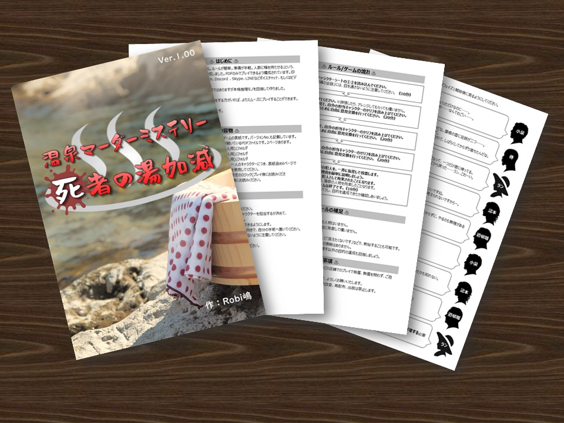
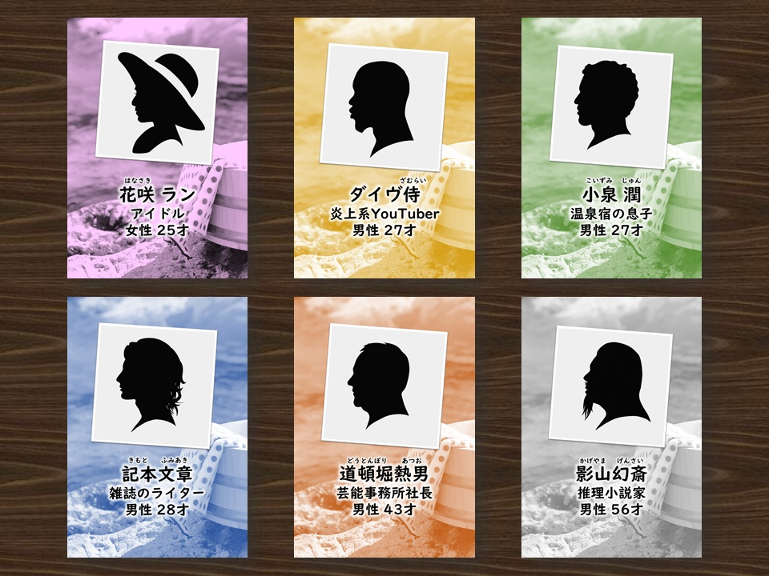
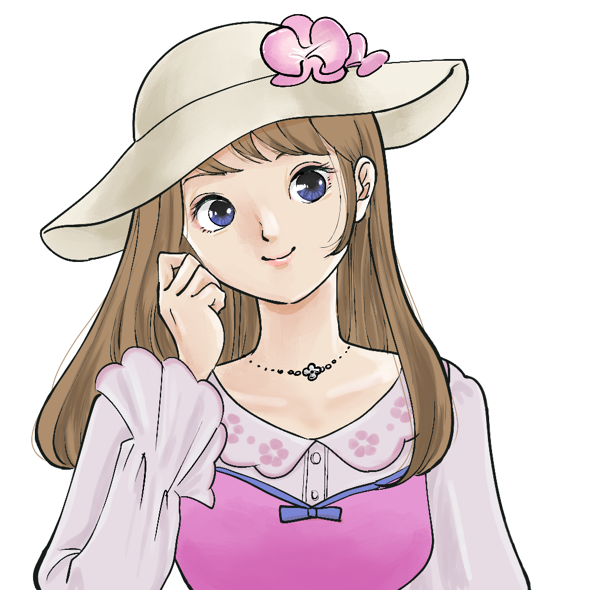
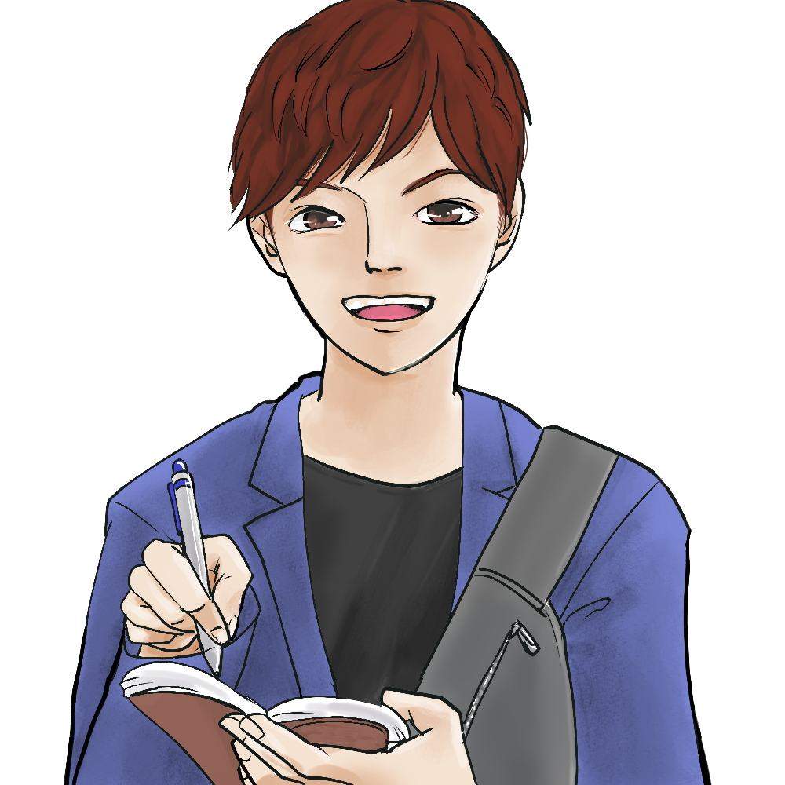
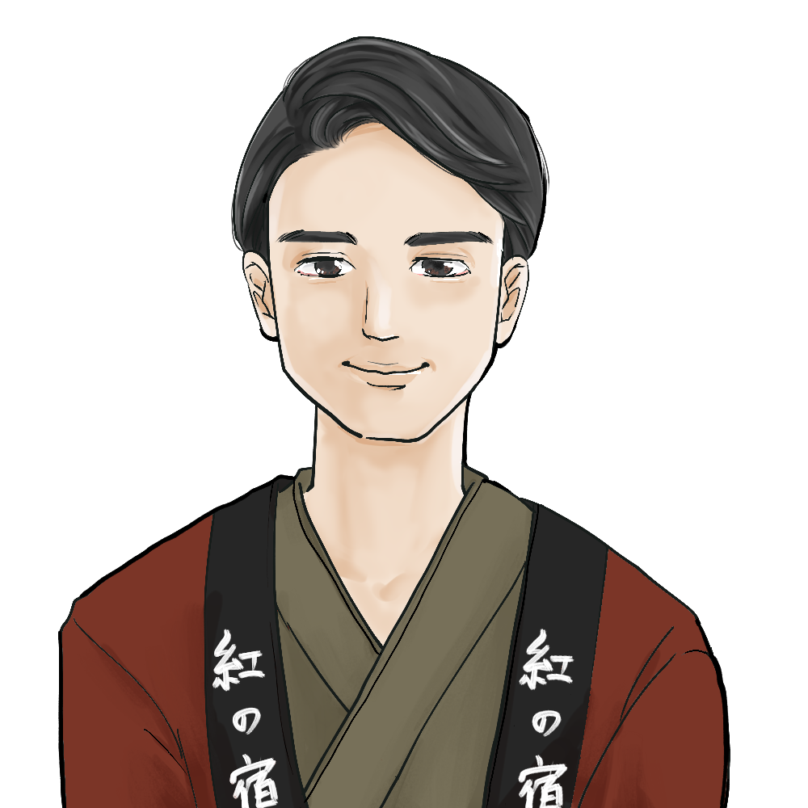
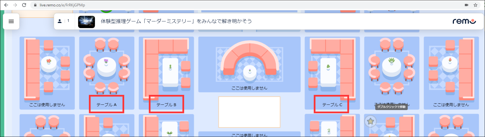

# FS 5月度レクリエーション案内

順番抽選ツール:  
https://raw.githack.com/fs5013-furi-sutao/fs-rec-2021-05-murder-mystery/main/ordering-tool.html

## 体験型推理ゲーム「マーダーミステリー」をみんなで解き明かそう

### マーダーミステリーとは？

集まったメンバーそれぞれが物語のキャラクターとして、物語のなかで起こるトラブルの原因や犯人を捜しつつ、自らの秘密のミッションを達成させる

🤔 会話型の推理ゲームです

&nbsp;&nbsp;

 

<table>
  <tr>
    <td rowspan="2"></td>
    <td><strong>花咲ラン</strong></td>
  </tr>
  <tr>
    <td>バラエティを中心に活躍するアイドル</td>
  </tr>
</table>

<table>
  <tr>
    <td rowspan="2"></td>
    <td><strong>記本文章</strong></td>
  </tr>
  <tr>
    <td>何でも扱うエンタメ系雑誌のライター</td>
  </tr>
</table>

<table>
  <tr>
    <td rowspan="2"></td>
    <td><strong>ダイヴ侍</strong></td>
  </tr>
  <tr>
    <td>炎上系YouTuber</td>
  </tr>
</table>

<table>
  <tr>
    <td rowspan="2"></td>
    <td><strong>小泉潤</strong></td>
  </tr>
  <tr>
    <td>紅の宿の息子。受付から掃除など、全般をやっている。</td>
  </tr>
</table>

<table>
  <tr>
    <td rowspan="2"></td>
    <td><strong>道頓堀熱男</strong></td>
  </tr>
  <tr>
    <td>赤木の所属する芸能事務所社長。</td>
  </tr>
</table>

# ⬛ 🕢 タイムテーブル

## はじめ

<table>
    <tr>
        <th>時刻</th>
        <th>所要時間</th>
        <th>内容</th>
        <th>備考</th>
    </tr>
    <tr>
        <td>12:50 ～</td>
        <td>―</td>
        <td>開場</td>
        <td>こちらから入場ください  FSマーダーミステリー・REMO： https://live.remo.co/e/4-728</td>
    </tr>
    <tr>
        <td>13:00 ～</td>
        <td>5分</td>
        <td>あいさつ</td>
        <td>―</td>
    </tr>
    <tr>
        <td>13:05 ～</td>
        <td>5分</td>
        <td>流れの説明</td>
        <td>プレイについては「自身キャラクターの目的」を達成できるように頑張ってください</td>
    </tr>
</table>

**※「死者の湯加減」のシナリオを知ってる人がいないか確認します**  
　→知ってる場合テーブルの移動をお願いします

 

## 🕢 各テーブルに別れてから
 
 <table>
    <tr>
        <td>14:10 ～</td>
        <td>10分</td>
        <td>自己紹介タイム</td>
        <td>自己流にアッピール</td>
    </tr>
    <tr>
        <td>14:20 ～</td>
        <td>5分</td>
        <td>①事前にアカウントの作成</td>
        <td>手順はこちらです： <a href="./how-to-get-starting-online-boad-game.md">ボードゲームアリーナでのアカウント作成手順</a></td>
    </tr>
    <tr>
        <td>14:25 ～</td>
        <td>5分</td>
        <td>②友達の追加</td>
        <td><a href="https://ja.boardgamearena.com/">サイト</a> 上部 
👉「コミュニティ」クリック 
👉 友達に加える欄に、テーブル内のメンバーのプレイヤー名を入力 
👉 完了</td>
    </tr>
    <tr>
        <td>―</td>
        <td>―</td>
        <td>③ゲームを探す</td>
        <td><a href="https://ja.boardgamearena.com/">サイト</a> 上部 
👉「ゲームテーブルの作成・参加」クリック 
👉 シンプルゲーム 
👉 リアルタイム 
👉 友達と遊ぶ 
👉「ゲームを探す」にゲーム名を入力 
👉 プレイ！</td>
    </tr>
</table>

### 本日は、次の 3 つのゲームをプレイします！

- ゲーム① [ニムト（6 nimmt!）](https://ja.boardgamearena.com/gamepanel?game=sechsnimmt)
- ゲーム② [スカル(Skull)](https://ja.boardgamearena.com/gamepanel?game=skull)
- ゲーム③ [お邪魔者(Saboteur)](https://ja.boardgamearena.com/gamepanel?game=saboteur)

 
    
## 🕢 ゲーム① ニムト（6 nimmt!）
 
 <table>
    <tr>
        <td>14:30 ～</td>
        <td>10分</td>
        <td>ゲーム①（ニムト）のやり方説明</td>
        <td>近藤が説明します（<a href="https://youtu.be/KuxTF5JQKJc">動画</a> を元に）</td>
    </tr>
    <tr>
        <td>14:40 ～</td>
        <td>10分</td>
        <td>ゲーム①（ニムト）のやり方 Q&amp;A</td>
        <td>近藤が答えます</td>
    </tr>
    <tr>
        <td>14:50 ～</td>
        <td>15分</td>
        <td>各グループでニムトにトライ！</td>
        <td>手慣らしです。時間になったらバッサリ終了します</td>
    </tr>
</table>

 
    
## 🕢 ゲーム② スカル(Skull)
 
 <table>
    <tr>
        <td>15:05 ～</td>
        <td>10分</td>
        <td>ゲーム②（スカル）のやり方説明</td>
        <td>近藤が説明します（<a href="https://youtu.be/3oHEVjG8lTg">動画</a> を元に）</td>
    </tr>
    <tr>
        <td>15:15 ～</td>
        <td>10分</td>
        <td>ゲーム②（スカル）のやり方 Q&amp;A</td>
        <td>近藤が答えます</td>
    </tr>
    <tr>
        <td>15:25 ～</td>
        <td>15分</td>
        <td>各グループでスカルにトライ！</td>
        <td>手慣らしです。時間になったらバッサリ終了します</td>
    </tr>
</table>

 
    
## 🕢 ゲーム③ お邪魔者(Saboteur)
 
 <table>
    <tr>
        <td>15:40 ～</td>
        <td>10分</td>
        <td>ゲーム③（お邪魔者）のやり方説明</td>
        <td>近藤が説明します（<a href="https://youtu.be/jznUgt85YPc">動画</a> を元に）</td>
    </tr>
    <tr>
        <td>15:50 ～</td>
        <td>10分</td>
        <td>ゲーム③（お邪魔者）のやり方 Q&amp;A</td>
        <td>近藤が答えます</td>
    </tr>
    <tr>
        <td>16:00 ～</td>
        <td>15分</td>
        <td>各グループでお邪魔者にトライ！</td>
        <td>手慣らしです。時間になったらバッサリ終了します</td>
    </tr>
</table>

 
    
## 🕢 テーブルチェンジ
 
 <table>
    <tr>
        <td>16:15 ～</td>
        <td>5分</td>
        <td>イス取りゲーム</td>
        <td>やりたいゲームのテーブルに着席（早いもの順）</td>
    </tr>
    <tr>
        <td>16:20 ～</td>
        <td>35分</td>
        <td>各テーブルで本気プレイ！</td>
        <td>全力でプレイしましょう</td>
    </tr>
    <tr>
        <td>16:55 ～</td>
        <td>5分</td>
        <td>おわりに</td>
        <td>みなさん、お疲れ様でした</td>
    </tr>
</table>

### 17:00 ～ 希望者が集まれば AmongUs をやります 

> 参加されたい方は 17:00 になったら、  
> DISCORD > RELAXATION >  📢休憩室 にお越しください  
> https://discord.gg/8NX59XN

# ⬛ 👩‍👩‍👧‍👦 今回のグループ分け

## 1回目のテーブル

<table>
    <tr>
        <th></th>
        <th>A テーブル</th>
        <th>B テーブル</th>
        <th>C テーブル</th>
        <th>D テーブル</th>
    </tr>
    <tr>
        <td>1</td>
        <td>近藤大揮（人事）</td>
        <td>奥原有貴（管理）</td>
        <td>中川堅太（受託）</td>
        <td>橋本夏樹（人事）</td>
    </tr>
    <tr>
        <td>2</td>
        <td>田中聖人</td>
        <td>太田康介（ゲーム）</td>
        <td>内田祐太</td>
        <td>佐藤和輝</td>
    </tr>
    <tr>
        <td>3</td>
        <td>山本晃大</td>
        <td>松浦晴菜</td>
        <td>斉藤憲吾</td>
        <td>大林達矢</td>
    </tr>
    <tr>
        <td>4</td>
        <td>太田真康</td>
        <td>林江里香（新卒）</td>
        <td>五斗圭</td>
        <td>各務拓</td>
    </tr>
    <tr>
        <td>5</td>
        <td>鍛治宏旭（新卒）</td>
        <td>荒川貴詳</td>
        <td>中島駿介</td>
        <td>牧野祥太</td>
    </tr>
    <tr>
        <td>6</td>
        <td>―</td>
        <td>―</td>
        <td>羽賀文哉</td>
        <td>―</td>
    </tr>
</table>

## 2回目のテーブル

<table>
    <tr>
        <th>ニムト [ １ ]</th>
        <th>ニムト [ ２ ]</th>
        <th>スカル [ １ ]</th>
        <th>スカル [ ２ ]</th>
        <th>お邪魔者 [ １ ]</th>
        <th>お邪魔者 [ ２ ]</th>
    </tr>
    <tr>
        <td colspan="6">イス取りゲーム形式でテーブルチェンジします！</td>
    </tr>
</table>

 

 

# 🧩🎲 今回トライするゲーム① ニムト（6 nimmt!）

> ## ゲーム説明動画
> 
>     
> ニムト（6 nimmt!）1分半でわかるルール動画（1分54秒）：  
> https://youtu.be/KuxTF5JQKJc

> ## ルール説明書
> 
> ニムト 遊び方説明書：  
> [http://www.mobius-games.co.jp/PDF/nimmt.pdf](http://www.mobius-games.co.jp/PDF/nimmt.pdf)

 

# 🧩🎲 今回トライするゲーム② スカル(Skull)

> ## ゲーム説明動画
> 
>   
> 【ボードゲーム】スカル（髑髏と薔薇）　ふんわり遊び方動画（2分16秒）：  
> https://youtu.be/3oHEVjG8lTg

> ## ルール説明書
> 
> スカル(Skull) 遊び方説明書：  
> [https://www.tk-game-diary.net/skull_roses/skull_roses.html](https://www.tk-game-diary.net/skull_roses/skull_roses.html)

 

# 🧩🎲 今回トライするゲーム③ お邪魔者(Saboteur)

> ## ゲーム説明動画
> 
>     
> フクハナのボードゲーム紹介 お邪魔者（13分14秒）：  
> https://youtu.be/jznUgt85YPc

> ## ルール説明書
> 
> お邪魔者(Saboteur) 遊び方説明書：  
> [https://www.tk-game-diary.net/saboteur/saboteur.html](https://www.tk-game-diary.net/saboteur/saboteur.html)

 
