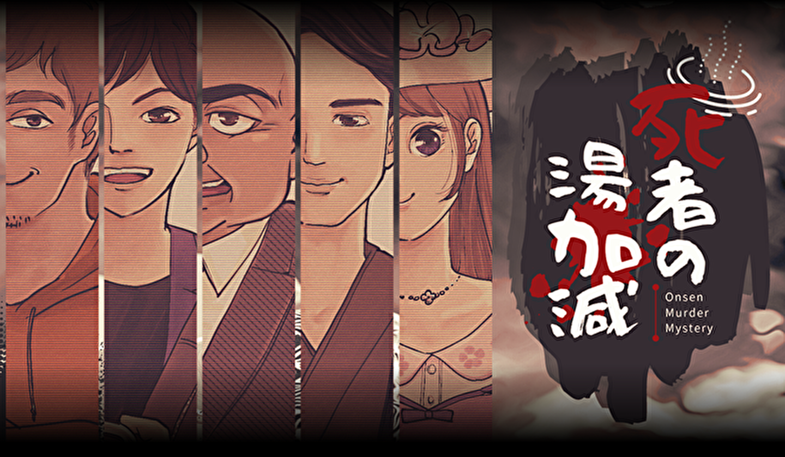
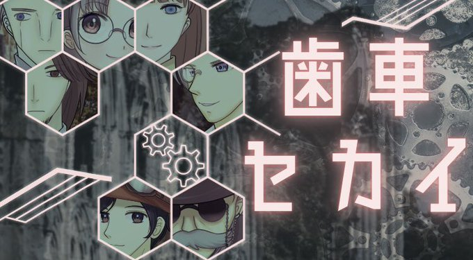

# FS 5月度レクリエーション案内

## 体験型推理ゲーム「マーダーミステリー」をみんなで解き明かそう

### マーダーミステリーとは？

集まったメンバーそれぞれが物語のキャラクターとして、物語のなかで起こるトラブルの原因や犯人を捜しつつ、自らの秘密のミッションを達成させる

🤔 会話型の推理ゲームです

 

## 今回のシナリオ

今回はシナリオを2つ用意しています

- シナリオ.1: **死者の湯加減**（Aテーブル と Bテーブル で使用するシナリオです）
- シナリオ.2: **歯車セカイ**（Cテーブルで使用するシナリオです）

&nbsp;&nbsp;

 

# ⬛ 👩‍👩‍👧‍👦 テーブル分け

以下に、テーブルごとのメンバを記載します（敬称）。

<table>
  <tr>
    <td>テーブル名</td>
    <td>シナリオ</td>
    <td>配役</td>
    <td>メンバ</td>
    <td>事前ダウンロード</td>
  </tr>
  <tr>
    <td rowspan="6">A テーブル</td>
    <td rowspan="6">死者の湯加減</td>
    <td>1</td>
    <td>中野義嗣</td>
    <td><a href="https://github.com/fs5013-furi-sutao/fs-rec-2021-05-murder-mystery/raw/main/senario/01.onsen/6players/01.zip">zip ファイルをダウンロード</a></td>
  </tr>
  <tr>
    <td>2</td>
    <td>赤木優輝</td>
    <td><a href="https://github.com/fs5013-furi-sutao/fs-rec-2021-05-murder-mystery/raw/main/senario/01.onsen/6players/02.zip">zip ファイルをダウンロード</a></td>
  </tr>
  <tr>
    <td>3</td>
    <td>荒川貴詳</td>
    <td><a href="https://github.com/fs5013-furi-sutao/fs-rec-2021-05-murder-mystery/raw/main/senario/01.onsen/6players/03.zip">zip ファイルをダウンロード</a></td>
  </tr>
  <tr>
    <td>4</td>
    <td>大鹿悠蘭</td>
    <td><a href="https://github.com/fs5013-furi-sutao/fs-rec-2021-05-murder-mystery/raw/main/senario/01.onsen/6players/04.zip">zip ファイルをダウンロード</a></td>
  </tr>
  <tr>
    <td>5</td>
    <td>松浦晴菜</td>
    <td><a href="https://github.com/fs5013-furi-sutao/fs-rec-2021-05-murder-mystery/raw/main/senario/01.onsen/6players/05.zip">zip ファイルをダウンロード</a></td>
  </tr>
  <tr>
    <td>6</td>
    <td>佐藤和輝</td>
    <td><a href="https://github.com/fs5013-furi-sutao/fs-rec-2021-05-murder-mystery/raw/main/senario/01.onsen/6players/06.zip">zip ファイルをダウンロード</a></td>
  </tr>
  <tr>
    <td colspan="4">ゲーム終了後に<strong>赤木さん</strong>が PDF を開いて みんなに説明してください</td>
    <td><a href="https://github.com/fs5013-furi-sutao/fs-rec-2021-05-murder-mystery/raw/main/senario/01.onsen/6players/top-secret_open-at-last.zip">ゲーム終了後に開く秘密の PDF</a></td>
  </tr>
</table>

※**大鹿さん**がタイムウォッチャ（時間進行）を行うようにお願いします

 

<table>
  <tr>
    <td>テーブル名</td>
    <td>シナリオ</td>
    <td>配役</td>
    <td>メンバ</td>
    <td>事前ダウンロード</td>
  </tr>
  <tr>
    <td rowspan="5">B テーブル</td>
    <td rowspan="5">死者の湯加減</td>
    <td>1</td>
    <td>太田康介</td>
    <td><a href="https://github.com/fs5013-furi-sutao/fs-rec-2021-05-murder-mystery/raw/main/senario/01.onsen/5players/01.zip">zip ファイルをダウンロード</a></td>
  </tr>
  <tr>
    <td>2</td>
    <td>水野愛美</td>
    <td><a href="https://github.com/fs5013-furi-sutao/fs-rec-2021-05-murder-mystery/raw/main/senario/01.onsen/5players/02.zip">zip ファイルをダウンロード</a></td>
  </tr>
  <tr>
    <td>3</td>
    <td>鍛治宏旭</td>
    <td><a href="https://github.com/fs5013-furi-sutao/fs-rec-2021-05-murder-mystery/raw/main/senario/01.onsen/5players/03.zip">zip ファイルをダウンロード</a></td>
  </tr>
  <tr>
    <td>4</td>
    <td>斉藤憲吾</td>
    <td><a href="https://github.com/fs5013-furi-sutao/fs-rec-2021-05-murder-mystery/raw/main/senario/01.onsen/5players/04.zip">zip ファイルをダウンロード</a></td>
  </tr>
  <tr>
    <td>5</td>
    <td>渋谷誠之</td>
    <td><a href="https://github.com/fs5013-furi-sutao/fs-rec-2021-05-murder-mystery/raw/main/senario/01.onsen/5players/05.zip">zip ファイルをダウンロード</a></td>
  </tr>
  <tr>
    <td colspan="4">ゲーム終了後に<strong>水野さん</strong>が PDF を開いて みんなに説明してください</td>
    <td><a href="https://github.com/fs5013-furi-sutao/fs-rec-2021-05-murder-mystery/raw/main/senario/01.onsen/5players/top-secret_open-at-last.zip">ゲーム終了後に開く秘密の PDF</a></td>
  </tr>
</table>

※**斉藤さん**がタイムウォッチャ（時間進行）を行うようにお願いします

 

<table>
  <tr>
    <td>テーブル名</td>
    <td>シナリオ</td>
    <td>配役</td>
    <td>メンバ</td>
    <td>事前ダウンロード</td>
  </tr>
  <tr>
    <td rowspan="5">C テーブル</td>
    <td rowspan="5">歯車セカイ</td>
    <td>1</td>
    <td>今立唯子</td>
    <td><a href="https://github.com/fs5013-furi-sutao/fs-rec-2021-05-murder-mystery/raw/main/senario/02.gears/5players/01.zip">zip ファイルをダウンロード</a></td>
  </tr>
  <tr>
    <td>2</td>
    <td>近藤大揮</td>
    <td><a href="https://github.com/fs5013-furi-sutao/fs-rec-2021-05-murder-mystery/raw/main/senario/02.gears/5players/02.zip">zip ファイルをダウンロード</a></td>
  </tr>
  <tr>
    <td>3</td>
    <td>森澤直之</td>
    <td><a href="https://github.com/fs5013-furi-sutao/fs-rec-2021-05-murder-mystery/raw/main/senario/02.gears/5players/03.zip">zip ファイルをダウンロード</a></td>
  </tr>
  <tr>
    <td>4</td>
    <td>五斗圭</td>
    <td><a href="https://github.com/fs5013-furi-sutao/fs-rec-2021-05-murder-mystery/raw/main/senario/02.gears/5players/04.zip">zip ファイルをダウンロード</a></td>
  </tr>
  <tr>
    <td>5</td>
    <td>田中聖人</td>
    <td><a href="https://github.com/fs5013-furi-sutao/fs-rec-2021-05-murder-mystery/raw/main/senario/02.gears/5players/05.zip">zip ファイルをダウンロード</a></td>
  </tr>
  <tr>
    <td colspan="4">ゲーム終了後に<strong>今立さん</strong>が PDF を開いて みんなに説明してください</td>
    <td><a href="https://github.com/fs5013-furi-sutao/fs-rec-2021-05-murder-mystery/raw/main/senario/02.gears/5players/top-secret_open-at-last.zip">ゲーム終了後に開く秘密の PDF</a></td>
  </tr>
</table>

※**近藤さん**がタイムウォッチャ（時間進行）を行うようにお願いします

 

# ⬛ 🕢 タイムテーブル

## はじめ

<table>
    <tr>
        <th>時刻</th>
        <th>所要時間</th>
        <th>内容</th>
        <th>備考</th>
    </tr>
    <tr>
        <td>12:50 ～</td>
        <td>―</td>
        <td>開場</td>
        <td>こちらから入場ください  FSマーダーミステリー・REMO： https://live.remo.co/e/4-728</td>
    </tr>
    <tr>
        <td>13:00 ～</td>
        <td>5分</td>
        <td>あいさつ</td>
        <td>―</td>
    </tr>
    <tr>
        <td>13:05 ～</td>
        <td>5分</td>
        <td>流れの説明</td>
        <td>プレイについては「自身キャラクターの目的」を達成できるように頑張ってください</td>
    </tr>
</table>

 

## 🕢 各テーブルに別れてから

### シナリオが「死者の湯加減」の場合

<table>
  <tr>
    <td>時刻</td>
    <td>所要時間</td>
    <td>内容</td>
  </tr>
  <tr>
    <td>13:10 ～</td>
    <td>10分</td>
    <td>キャラシート読</td>
  </tr>
  <tr>
    <td>13:20 ～</td>
    <td>20分</td>
    <td>フェイズ1</td>
  </tr>
  <tr>
    <td>13:40 ～</td>
    <td>20分</td>
    <td>フェイズ2</td>
  </tr>
  <tr>
    <td>14:00 ～</td>
    <td>20分</td>
    <td>フェイズ3</td>
  </tr>
  <tr>
    <td>14:20 ～</td>
    <td>10分</td>
    <td>投票、理由の説明</td>
  </tr>
  <tr>
    <td>14:30 ～</td>
    <td>10分</td>
    <td>感想ディスカッション</td>
  </tr>
</table>

 

### シナリオが「歯車セカイ」の場合

<table>
  <tr>
    <td>時刻</td>
    <td>所要時間</td>
    <td>内容</td>
  </tr>
  <tr>
    <td>13:10 ～</td>
    <td>10分</td>
    <td>ハンドアウト読</td>
  </tr>
  <tr>
    <td>13:20 ～</td>
    <td>5分</td>
    <td>自己紹介</td>
  </tr>
  <tr>
    <td>13:25 ～</td>
    <td>5分</td>
    <td>01_導入.txt</td>
  </tr>
  <tr>
    <td>13:30 ～</td>
    <td>2分</td>
    <td>情報確認1</td>
  </tr>
  <tr>
    <td>13:32 ～</td>
    <td>15分</td>
    <td>議論フェイズ1</td>
  </tr>
  <tr>
    <td>13:47 ～</td>
    <td>2分</td>
    <td>情報確認2</td>
  </tr>
  <tr>
    <td>13:49 ～</td>
    <td>15分</td>
    <td>議論フェイズ2</td>
  </tr>
  <tr>
    <td>14:04 ～</td>
    <td>5分</td>
    <td>推理フェイズ</td>
  </tr>
  <tr>
    <td>14:09 ～</td>
    <td>15分</td>
    <td>最終議論</td>
  </tr>
  <tr>
    <td>14:24 ～</td>
    <td>5分</td>
    <td>投票</td>
  </tr>
  <tr>
    <td>14:29 ～</td>
    <td>2分</td>
    <td>エンディング</td>
  </tr>
  <tr>
    <td>14:31 ～</td>
    <td>9分</td>
    <td>感想ディスカッション</td>
  </tr>
</table>

## 🕢 テーブルチェンジ

<table>
  <tr>
    <td>時刻</td>
    <td>所要時間</td>
    <td>内容</td>
    <td>備考</td>
  </tr>
  <tr>
    <td>14:40 ～</td>
    <td>15分</td>
    <td>感想ディスカッション</td>
    <td>テーブルチェンジしてトーク</td>
  </tr>
  <tr>
    <td>14:55 ～</td>
    <td>5分</td>
    <td>おわりに</td>
    <td>みなさん、お疲れ様でした</td>
  </tr>
</table>

 
